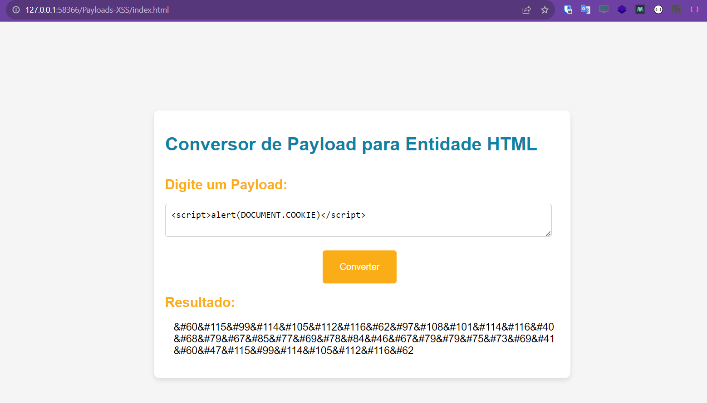

# ConverterEntityHTML
Faz a conversão de um payload em caracteres Entidade HTML

 

Rodar com Live Server

Lista Entidades HTML

### Caracteres Alfabéticos Maiusculos:
    
&#65 = 'A'

&#66 = 'B'

&#67 = 'C'

&#68 = 'D' 

&#69 = 'E' 

&#70 = 'F' 

&#71 = 'G' 

&#72 = 'H' 

&#73 = 'I' 

&#74 = 'J' 

&#75 = 'K' 

&#76 = 'L' 

&#77 = 'M' 

&#78 = 'N' 

&#79 = 'O' 

&#80 = 'P' 

&#81 = 'Q' 

&#82 = 'R' 

&#83 = 'S' 

&#84 = 'T' 

&#85 = 'U' 

&#86 = 'V' 

&#87 = 'W' 

&#88 = 'X' 

&#89 = 'Y' 

&#90 = 'Z' 

### Caracteres Alfabéticos Minusculos:
    
&#97 = 'a' 

&#98 = 'b' 

&#99 = 'c' 

&#100 = 'd' 

&#101 = 'e' 

&#102 = 'f' 

&#103 = 'g' 

&#104 = 'h' 

&#105 = 'i' 

&#106 = 'j' 

&#107 = 'k' 

&#108 = 'l' 

&#109 = 'm' 

&#110 = 'n' 

&#111 = 'o' 

&#112 = 'p' 

&#113 = 'q' 

&#114 = 'r' 

&#115 = 's' 

&#116 = 't' 

&#117 = 'u' 

&#118 = 'v' 

&#119 = 'w' 

&#120 = 'x' 

&#121 = 'y' 

&#122 = 'z' 

### Caracteres Numericos:
    
&#48 = '0' 

&#49 = '1' 

&#50 = '2' 

&#51 = '3' 

&#52 = '4' 

&#53 = '5' 

&#54 = '6' 

&#55 = '7' 

&#56 = '8' 

&#57 = '9' 

### Caracteres Especiais Comuns:
    
&#33 = '!' 

&#34 = '"' 

&#35 = '#' 

&#36 = '$' 

&#37 = '%' 

&#38 = '&' 

&#39 = "'" 

&#40 = '(' 

&#41 = ')' 

&#42 = '*' 

&#43 = '+' 

&#44 = ',' 

&#45 = '-' 

&#46 = '.' 

&#47 = '/' 

&bsol = '\' 

Correspondem a caracteres de controle &#01 a &#32, que não têm uma representação gráfica visível.
Eles são caracteres especiais usados para controlar dispositivos de saída de texto.

&#01 = o início de cabeçalho de início de texto (Start of Header - SOH)  

&#02 = o início de texto (Start of Text - STX)  

&#03 = o fim de texto (End of Text - ETX)  

&#04 = o fim de transmissão (End of Transmission - EOT)  

&#05 = o enquadramento de consulta (Enquiry - ENQ)  

&#06 = o reconhecimento (Acknowledgment - ACK)  

&#07 = o sino (Bell - BEL)  

&#08 = o caractere de retrocesso (Backspace - BS)  

&#09 = o caractere de tabulação horizontal (Horizontal Tab - HT)  

&#10 = a alimentação de linha (Line Feed - LF)  

&#11 = o caractere de tabulação vertical (Vertical Tab - VT)  

&#12 = o form feed (Form Feed - FF)  

&#13 = o retorno de carro (Carriage Return - CR)  

&#14 = o deslocamento de 14 posições à esquerda (Shift Out - SO)  

&#15 = o deslocamento de 15 posições à esquerda (Shift In - SI)  

&#16 = o deslocamento de 16 posições à esquerda (Data Link Escape - DLE)  

&#17 = o dispositivo de controle 1 (Device Control 1 - DC1)  

&#18 = o dispositivo de controle 2 (Device Control 2 - DC2)  

&#19 = o dispositivo de controle 3 (Device Control 3 - DC3)  

&#20 = o dispositivo de controle 4 (Device Control 4 - DC4)  

&#21 = o negrito ativo (Negative Acknowledgment - NAK)  

&#22 = o síncrono bloquear (Synchronous Idle - SYN)  

&#23 = o fim do bloco de transmissão (End of Transmission Block - ETB)  

&#24 = o cancelamento (Cancel - CAN)  

&#25 = o fim do meio (End of Medium - EM)  

&#26 = o substituto (Substitute - SUB)  

&#27 = o escape (Escape - ESC)  

&#28 = o separador de arquivo (File Separator - FS)  

&#29 = o separador de grupo (Group Separator - GS)  

&#30 = o separador de registro (Record Separator - RS)  

&#31 = o separador de unidade (Unit Separator - US)  

&#32 = o espaço em branco  
